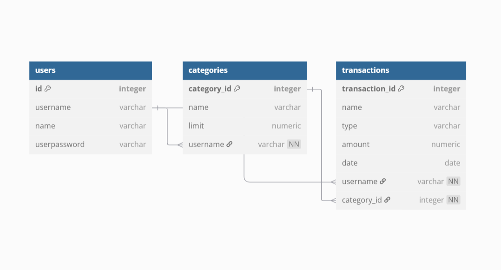

# 💸 Wealthwiz

**Wealthwiz** is an AI-powered web app that helps users manage their finances with smart expense tracking, budgeting tools, and personalized financial advice.

By analyzing transaction history and spending behavior, it delivers tailored insights, alerts, and investment suggestions based on income, risk profile, and goals — all in one place.

## 📚 Table of Contents

- [🎬 Demo Video](#-demo-video)
- [✨ Features](#-features)
- [🧰 Tech Stack](#-tech-stack)
- [🗃️ Database Overview](#-database-overview)
- [🚧 Project Roadmap](#-project-roadmap)
- [🙋‍♀️ Author](#-author)

## 🎬 Demo Video

Click to watch the full demo here:  

## ✨ Features

- 🔍 **Expense Tracking** – Easily log and monitor income and expenses.
- 🗂️ **Custom Categories** – Create personalized spending categories that fit your lifestyle.
- 📉 **Spending Limits** – Set monthly limits and receive alerts when you’re close to exceeding them.
- 🤖 **AI Financial Advisor** – Chatbot-powered advice based on your financial behavior.
- 📊 **Reports & Insights** – Visualize spending trends with charts and summaries.
- 💡 **Smart Suggestions** – Get proactive tips to cut overspending and optimize budgets.
- 🎯 **Investment Recommendations** *(coming soon)* – Receive tailored investment suggestions based on income, goals, and risk appetite.
- 🧠 **Context-Aware Guidance** – Ask anything about budgeting or savings and get simplified, personalized answers.

## 🧰 Tech Stack

- 🖼 Frontend: **EJS**, **Bootstrap 5**
- ⚙️ Backend: **Node.js**, **Express.js**
- 💾 Database: **PostgreSQL**
- 📊 Charts: **Chart.js**
- 🤖 AI: **Hyperleap** *(to be changed to Gemini for enhancement)*
- ☁️ Hosting: *(to be added)*

## 🗃️ Database Overview

Here’s a high-level view of the database schema used in FinGenie:

The main tables are:

- `users`: Stores user credentials and preferences
- `transactions`: Holds all income/expense records with category and timestamps
- `categories`: Contains custom categories and monthly spending limits

> 📌 ER diagram created using [dbdiagram.io](https://dbdiagram.io) 
<!-- 
Table users {
  id integer [primary key]
  username varchar
  name varchar
  userpassword varchar
}

Table categories {
  category_id integer [primary key]
  name varchar
  limit numeric
  username varchar [not null] // FK to users.username
}

Table transactions {
  transaction_id integer [primary key]
  name varchar
  type varchar
  amount numeric
  date date
  username varchar [not null] // FK to users.username
  category_id integer [not null] // FK to categories.category_id
}

Ref: categories.username > users.username
Ref: transactions.username > users.username
Ref: transactions.category_id > categories.category_id -->

## 🛣️ Project Roadmap

Here’s a high-level overview of what’s been completed and what’s coming next for **FinGenie**:

### ✅ Completed
- 🔐 User Authentication (Sign up, Login, Logout)
- ➕ Add, Edit & Delete Transactions
- 🗂️ Create and Manage Custom Spending Categories
- 📊 Generate Visual Reports (Category-wise breakdown, charts)
- 📉 Set Monthly Category Limits with Alert Reminders
- 💬 Integrated AI Assistant using **Hyperleap**

### 🚧 In Progress
- 🔄 Replacing current AI assistant with **Gemini AI**
- 🧠 Improving context-aware financial query handling
- 🧪 Testing and bug fixes for smoother interaction

### 🔜 Upcoming
- 🎯 Implement Personalized Investment Recommendations
- 🏦 Add Support for Importing Bank Statements (CSV/Excel)
- 📤 Export Reports (PDF/CSV)
- 🔔 Notification System for Smart Suggestions & Alerts

## 🙋‍♀️ Author

**Kavya D**  
GitHub: [@kavya410004](https://github.com/kavya410004)  
LinkedIn: [Venkata Kavya Sai D](https://www.linkedin.com/in/venkata-kavya-sai-d-bb7717250/)  
Email: d.v.kavyasai.2004@gmail.com  
